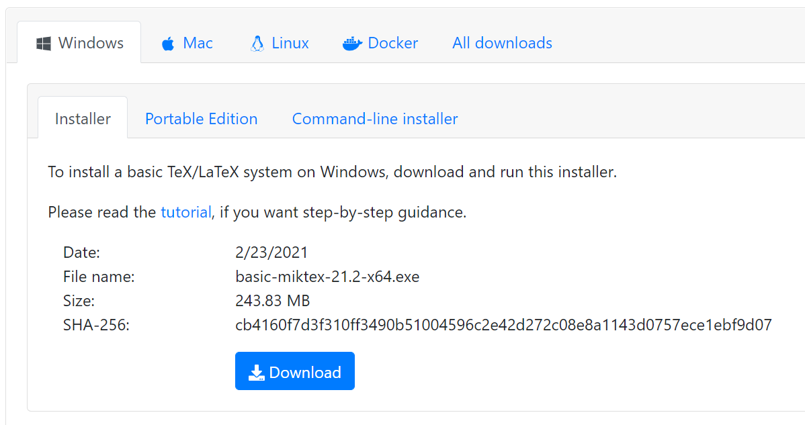
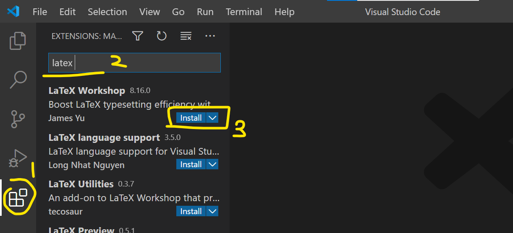
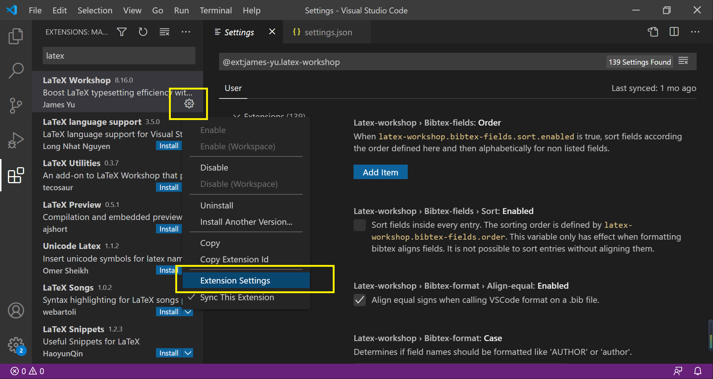
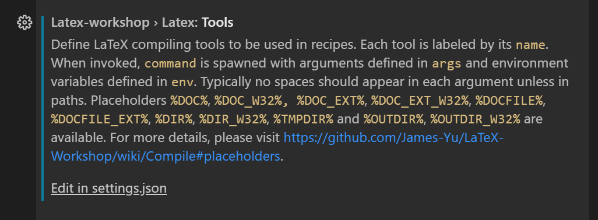
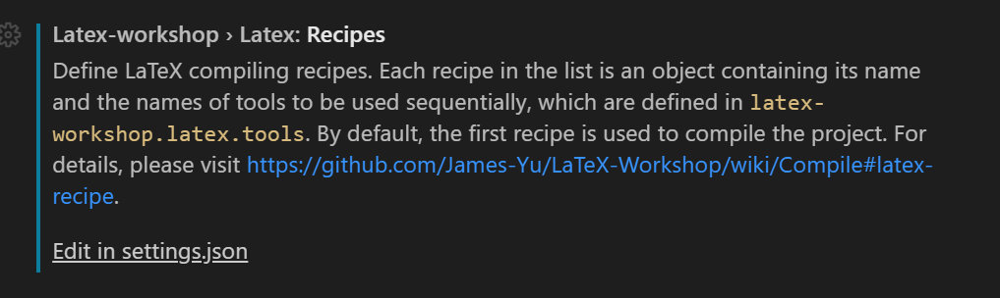
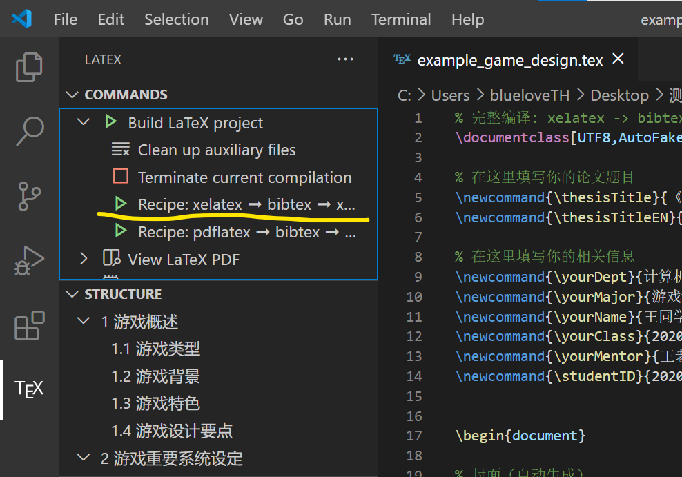

## 环境配置

#### 01 安装MiKTeX

进入MiKTeX[下载页面](https://miktex.org/download)，安装与自己操作系统对应的MiKTeX。



安装过程一直点下一步就可以了。见到**install missing packages**这个选项时，选Yes。


#### 02 安装VS Code + LaTeX Workshop

如果你没有VS Code，请先点[这个链接](https://code.visualstudio.com/Download)安装。

在侧边栏中选择扩展，搜索LaTeX Workshop插件，点击安装。




#### 03 配置LaTeX Workshop

安装完成后，点击齿轮选择**Extension Settings**。



在右边窗口找到**Auto Build**和**Auto Clean**两项，改成如下设置。


接着，找到**Tools**，点击Edit in settings.json。



向键`"latex-workshop.latex.tools"`添加下列项。

你需要按照JSON语法进行添加，注意嵌套括号的对应，数组元素之间以逗号分隔。

```json
		{
            "name": "xelatex",
            "command": "xelatex",
            "args": [
                "-synctex=1",
                "-interaction=nonstopmode",
                "-file-line-error",
                "%DOC%"
            ],
            "env": {}
        },
```

找到**Recipes**，点击Edit in settings.json。



向键`"latex-workshop.latex.recipes"`添加下列项。

```json
        {
            "name": "xelatex ➞ bibtex ➞ xelatex × 2",
            "tools": [
                "xelatex",
                "bibtex",
                "xelatex",
                "xelatex"
            ]
        },
```

至此环境配置已完成。


## 编译样例文件

进到模板文件夹，使用VS Code打开`example_game_design.tex`文件，在左侧边栏激活TEX面板，选择我们刚刚配置的Recipe（xelatex->bibtex->xelatex*2）进行编译。



如果一切正常，左下角将出现正在编译的进度条。

初次编译需要的时间较长（约15分钟），这是因为MiKTeX需要在线下载必要的宏包。

编译完成后，当前目录会生成最终的`example_game_design.pdf`文件。